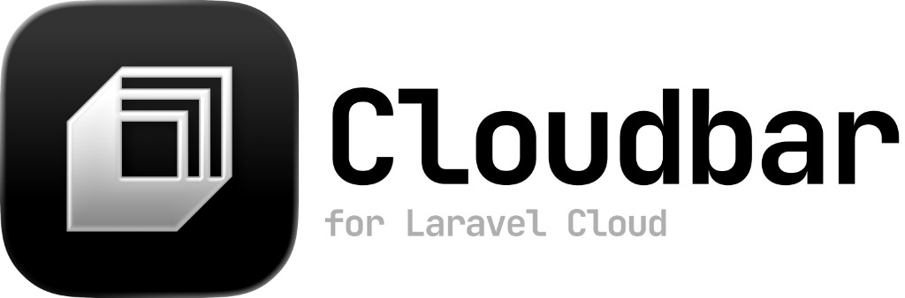

<p align="center">
  
</p>

<p align="center">
  A native macOS menu bar app for checking Laravel Cloud usage at a glance.
</p>

<p align="center">
  <a href="https://github.com/captenmasin/cloudbar/actions/workflows/ci.yml"></a>
</p>

<p align="center">
  
</p>

CloudBar calls the Laravel Cloud API with your bearer token and shows current spend, bandwidth, resource costs, application compute, add-ons, and billing alerts in the menu bar.

## Features

- **Menu bar spend display** — current spend shown directly in the menu bar
- **Usage popover** — spend, bandwidth, resources, application compute, add-ons, and alerts
- **Per-application filtering** — view organization totals or drill into a single application
- **Currency conversion** — display amounts in your preferred currency using live exchange rates
- **Secure token storage** — API token saved in the macOS Keychain

## Requirements

- macOS 14 or later
- Xcode 16+ / Swift 6 toolchain (for building from source)

## Install

### Download (recommended)

1. Go to [GitHub Releases](https://github.com/captenmasin/cloudbar/releases)
2. Download the latest `CloudBar.dmg`
3. Open the DMG and drag **CloudBar** to **Applications**
4. Launch CloudBar from Applications

### Build from source

See [Development](#development) below.

## First run

1. Click the CloudBar icon in the menu bar (or right-click and choose **Settings…**)
2. Create a Laravel Cloud API token under your profile settings at [cloud.laravel.com](https://cloud.laravel.com)
3. Paste the token into **Settings → CloudBar** and click **Save Token**

Your token is stored securely in the macOS Keychain under the service `com.captenmasin.cloudbar`. CloudBar uses it to call `GET https://cloud.laravel.com/api/usage` and related endpoints.


## Development

### Clone and run

```bash
git clone https://github.com/captenmasin/cloudbar.git
cd cloudbar
swift run CloudBar
```

### Test

```bash
swift test
```

### Build

```bash
swift build              # debug
swift build -c release   # release
```


## Security and privacy

- Your Laravel Cloud API token is stored only in the macOS Keychain — never in plain text on disk
- CloudBar communicates with:
  - `cloud.laravel.com` — Laravel Cloud usage and application data
  - `api.frankfurter.app` — exchange rates for currency conversion
- No analytics, telemetry, or third-party tracking

## License

MIT — see [LICENSE](LICENSE).

## Credits

- Built by [mason](https://masondoes.dev/)
- Usage data from [Laravel Cloud](https://cloud.laravel.com)
- Heavily influenced by [Codex Bar](https://codexbar.app/) ❤️
