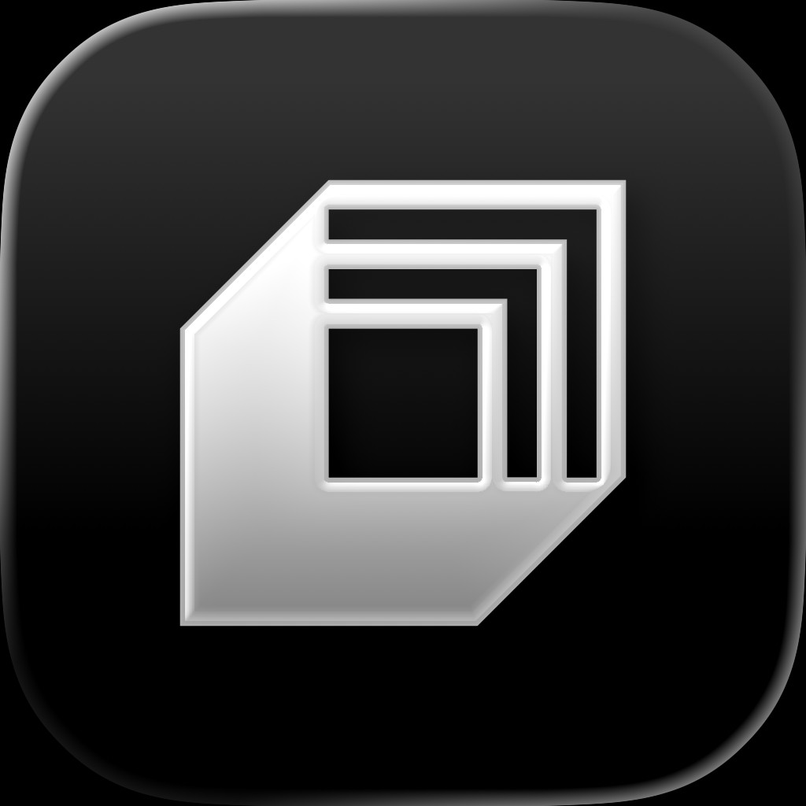
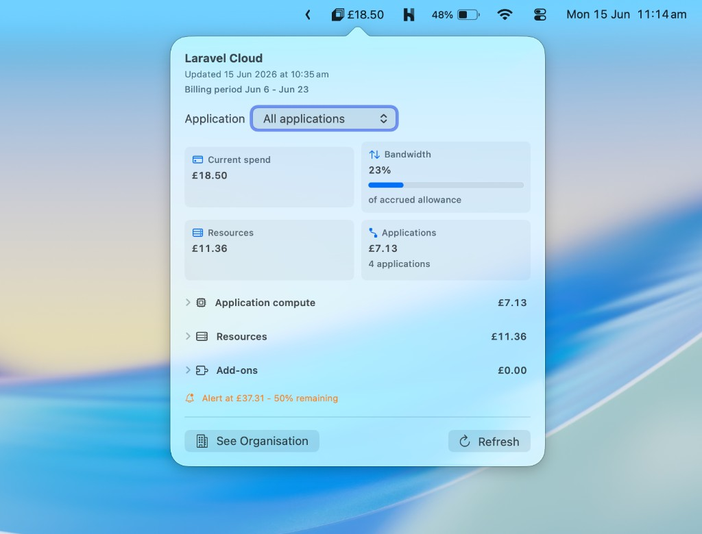

<p align="center">
  
</p>

<h1 align="center">CloudBar</h1>

<p align="center">
  A native macOS menu bar app for checking Laravel Cloud usage at a glance.
</p>

<p align="center">
  <a href="https://github.com/captenmasin/cloudbar/actions/workflows/ci.yml"></a>
</p>

<p align="center">
  
</p>

CloudBar calls the Laravel Cloud API with your bearer token and shows current spend, bandwidth, resource costs, application compute, add-ons, and billing alerts in the menu bar.

## Features

- **Menu bar spend display** — current spend shown directly in the menu bar
- **Usage popover** — spend, bandwidth, resources, application compute, add-ons, and alerts
- **Per-application filtering** — view organization totals or drill into a single application
- **Currency conversion** — display amounts in your preferred currency using live exchange rates
- **Secure token storage** — API token saved in the macOS Keychain

## Requirements

- macOS 14 or later
- Xcode 16+ / Swift 6 toolchain (for building from source)

## Install

### Download (recommended)

1. Go to [GitHub Releases](https://github.com/captenmasin/cloudbar/releases)
2. Download the latest `CloudBar.dmg`
3. Open the DMG and drag **CloudBar** to **Applications**
4. Launch CloudBar from Applications

### Build from source

See [Development](#development) below.

## First run

1. Click the CloudBar icon in the menu bar (or right-click and choose **Settings…**)
2. Create a Laravel Cloud API token under your profile settings at [cloud.laravel.com](https://cloud.laravel.com)
3. Paste the token into **Settings → CloudBar** and click **Save Token**

Your token is stored securely in the macOS Keychain under the service `com.cloudbar.laravel-cloud`. CloudBar uses it to call `GET https://cloud.laravel.com/api/usage` and related endpoints.

## Usage

| Action | How |
|--------|-----|
| Open usage popover | Left-click the menu bar icon |
| Open settings | Right-click the menu bar icon → **Settings…** (or **⌘,** from the context menu) |
| Refresh usage | Click **Refresh** in the popover |
| Filter by application | Choose an application from the picker in the popover |
| Change display currency | **Settings → CloudBar → Display currency** |
| View org usage on web | Click **See Organisation** in the popover |
| Quit | Right-click the menu bar icon → **Quit CloudBar** |

## Development

### Clone and run

```bash
git clone https://github.com/captenmasin/cloudbar.git
cd cloudbar
swift run CloudBar
```

### Test

```bash
swift test
```

### Build

```bash
swift build              # debug
swift build -c release   # release
```

### Package as an app

```bash
./scripts/package-app.sh
open Build/CloudBar.app
```

For release builds:

```bash
CONFIGURATION=release ./scripts/package-app.sh
```

Optional environment variables for packaging:

| Variable | Description |
|----------|-------------|
| `CONFIGURATION` | `debug` (default) or `release` |
| `VERSION` | Sets `CFBundleShortVersionString` in the packaged app |
| `BUILD_NUMBER` | Sets `CFBundleVersion` in the packaged app |

The packaged app is configured as an agent app with `LSUIElement`, so it appears in the menu bar without a Dock icon.

### Project structure

```
cloudbar/
├── Sources/CloudBar/       # App source (SwiftUI + AppKit)
│   └── Resources/          # Info.plist, icon, entitlements
├── Tests/CloudBarTests/    # Unit tests
├── scripts/
│   ├── package-app.sh      # Build .app bundle
│   └── sign-and-notarize.sh # Sign, DMG, notarize (release)
└── .github/workflows/      # CI and release automation
```

## Releasing

Releases are automated via GitHub Actions when a version tag is pushed (e.g. `v0.1.0`):

```bash
git tag v0.1.0
git push origin v0.1.0
```

The [Release workflow](.github/workflows/release.yml) builds, signs, notarizes, and publishes a `CloudBar.dmg` to GitHub Releases.

### Required GitHub secrets

Configure these under **Settings → Secrets and variables → Actions**:

| Secret | Description |
|--------|-------------|
| `APPLE_CERTIFICATE_BASE64` | Developer ID Application `.p12` certificate, base64-encoded |
| `APPLE_CERTIFICATE_PASSWORD` | Password used when exporting the certificate |
| `KEYCHAIN_PASSWORD` | Password for the ephemeral CI keychain (any strong random string) |
| `APPLE_API_KEY_ID` | App Store Connect API key ID |
| `APPLE_API_ISSUER_ID` | App Store Connect issuer ID |
| `APPLE_API_KEY_BASE64` | App Store Connect API key (`.p8` file), base64-encoded |
| `SIGNING_IDENTITY` | Full signing identity, e.g. `Developer ID Application: Your Name (TEAMID)` |

### One-time setup

**Export the signing certificate:**

1. Open **Keychain Access** on your Mac
2. Find your **Developer ID Application** certificate
3. Export as `.p12` with a password
4. Encode for GitHub: `base64 -i certificate.p12 | pbcopy`

**Create an App Store Connect API key:**

1. Go to [App Store Connect → Users and Access → Integrations → API](https://appstoreconnect.apple.com/access/integrations/api)
2. Create a key with **Developer** access
3. Download the `.p8` file
4. Encode for GitHub: `base64 -i AuthKey_XXXXX.p8 | pbcopy`

## Security and privacy

- Your Laravel Cloud API token is stored only in the macOS Keychain — never in plain text on disk
- CloudBar communicates with:
  - `cloud.laravel.com` — Laravel Cloud usage and application data
  - `api.frankfurter.app` — exchange rates for currency conversion
- No analytics, telemetry, or third-party tracking

## License

MIT — see [LICENSE](LICENSE).

## Credits

- Built by [mason](https://masondoes.dev/)
- Usage data from [Laravel Cloud](https://cloud.laravel.com)
